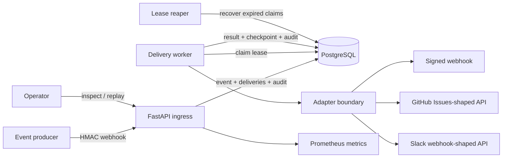

# Architecture

## Scope

This repository is a delivery laboratory for integration events. It accepts authenticated
webhooks, stores a canonical event and its delivery work in one database transaction, then uses
independent workers to execute adapter calls. It is not a general workflow-definition product.

## Components

### Ingress API

- Verifies a source-specific HMAC-SHA256 signature over the exact request bytes.
- Parses a strict canonical envelope with bounded field sizes and a bounded request body.
- Treats `(source, external_id)` as the producer event identity.
- Rejects reuse of that identity when the canonical content hash changes.
- Creates all matching delivery records in the same transaction as the event and audit record.
- Returns only after durable persistence succeeds.

### Relational inbox and delivery queue

`inbound_events` is the durable inbox. `deliveries` is the database-backed delivery queue. A unique
event/subscription pair prevents duplicate fan-out, while a unique idempotency key identifies the
outbound side effect. This design avoids a gap between accepting an event and enqueueing work.

### Delivery worker

Workers atomically transition one eligible delivery to `delivering`, assign a worker identity,
increment a fencing token, and set a lease expiry. Before calling an adapter, the processor checks
that the worker still owns the unexpired lease. Completion is conditional on the same worker,
fencing token, and lease.

### Ordering checkpoint

For sequenced events, a checkpoint is maintained per `(subscription, subject)`.

- `sequence == checkpoint + 1`: deliver and advance the checkpoint.
- `sequence > checkpoint + 1`: block temporarily as a sequence gap.
- `sequence <= checkpoint`: skip as already processed.

Successful delivery and checkpoint advancement commit together. This preserves the local delivery
state but does not create a distributed transaction with the remote integration.

### Recovery and replay

The reaper returns expired claims to `pending`. Transient failures use deterministic exponential
backoff with bounded jitter. Permanent failures and exhausted retries become `dead`. An authorized
operator can replay an unchanged dead delivery; replay resets attempts, increments replay tracking
and the fencing token, and writes an audit event.

### Adapter boundary

Adapters map the canonical event into deliberately narrow provider payloads:

- generic webhook: canonical event plus HMAC signature;
- GitHub Issues-shaped API: `title` and `body`;
- Slack webhook-shaped API: `text`.

All outbound requests carry an idempotency key. Provider response bodies and exception text are not
persisted.

## Consistency boundaries

The database is authoritative for accepted events, delivery state, checkpoints, and audit records.
The remote integration is eventually consistent with that state. The system provides at-least-once
delivery, not exactly-once execution: a worker can lose connectivity after a provider accepts a
request but before local acknowledgement. Consumers must honor the supplied idempotency key.

## Scaling characteristics

The design supports multiple workers through conditional claims and fencing tokens. The current
single-row candidate query is intentionally simple; a higher-throughput deployment should use a
PostgreSQL claim strategy such as `FOR UPDATE SKIP LOCKED`, partition work by ordering key, and
measure contention before selecting batch sizes.
