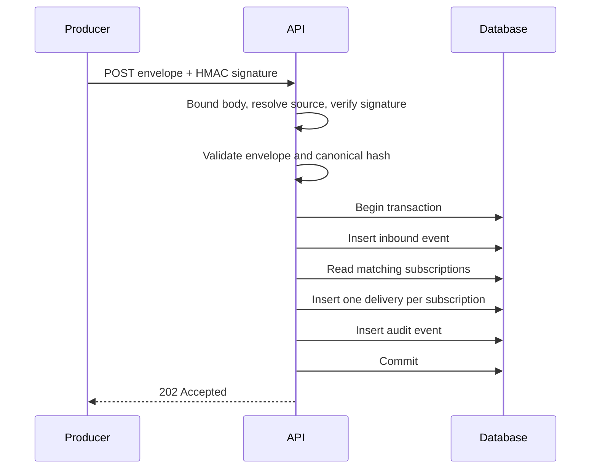
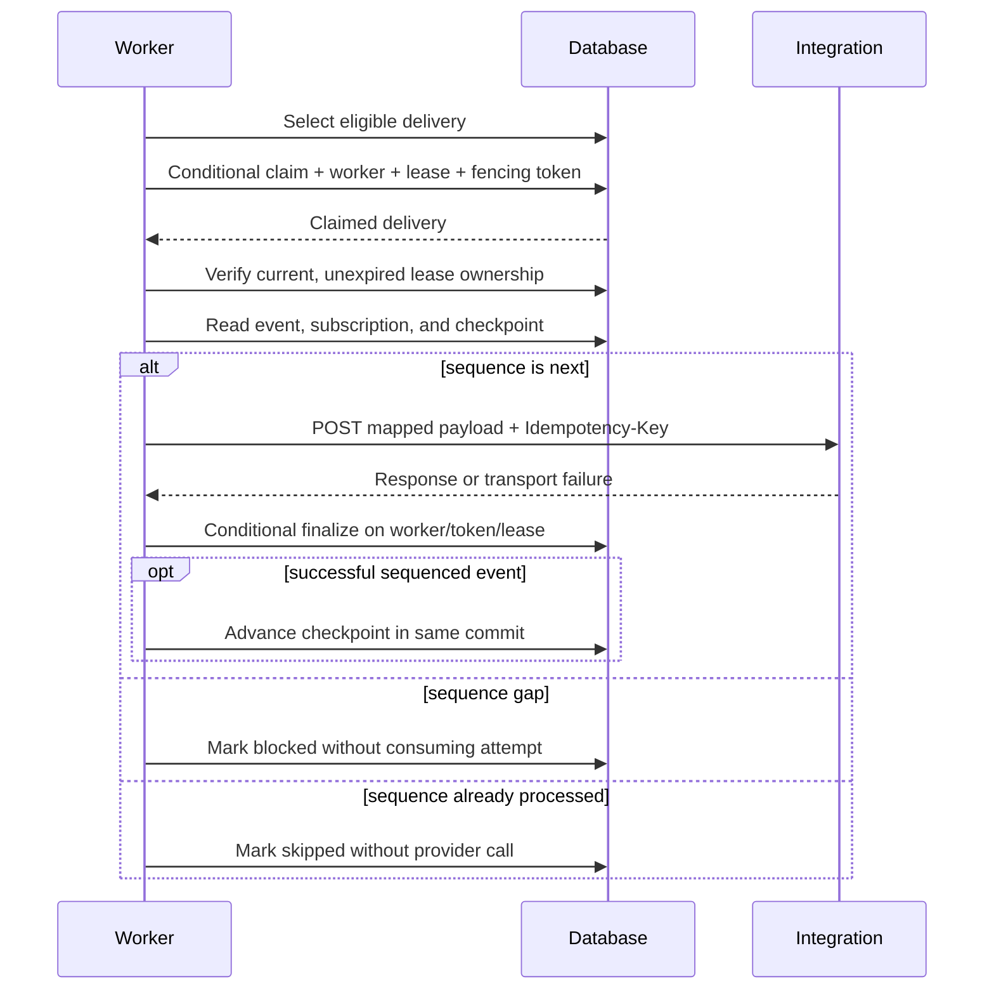
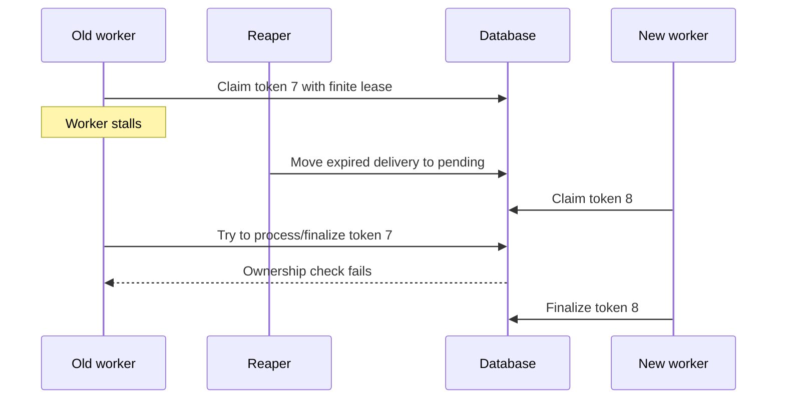
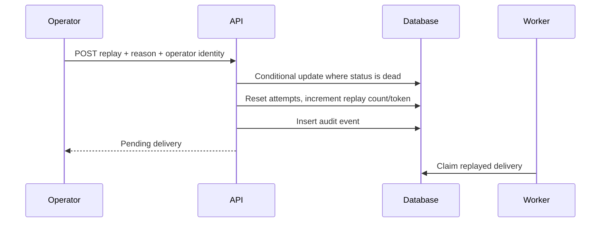

# Runtime Sequences

## Signed ingestion and fan-out

If `(source, external_id)` already exists, the API compares the stored canonical hash. Equal content
returns the existing event as a duplicate; changed content returns 409.

## Delivery attempt

## Lease recovery

## Dead-letter replay

